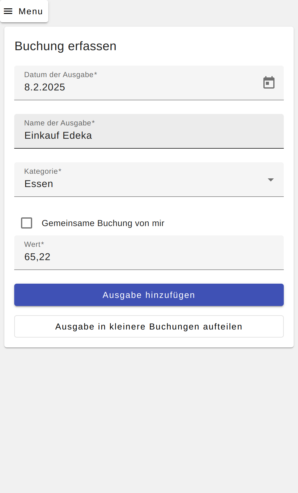

# Begleiter Web-App

## Menu

### Weitere Seiten

* [Hauptseite](index.md)
* [Desktop-Anwendung](butler-offline.md)

### Inhaltsverzeichnis

* [Idee](#idee)
* [Build](#build)
* [Betrieb](#betrieb)

## Idee

Die Begleiter Web-App ist eine Web-Anwendung, welche als Begleiter zur Desktop-Anwendung BudgetButlerWeb dient. Sie soll
ermöglichen, dass Buchungen auch ohne direkten Zugriff auf die Desktop-Anwendung erfasst werden können.

Sie ist nicht für eine dauerhafte Datenhaltung konzipiert, sondern soll lediglich als temporärer Speicher für Buchungen
dienen. Die Desktop-Anwendung kann die Buchungen aus der Begleiter Web-App importieren und anschließend löschen.

Jeweils 2 verschiedene Accounts können gemeinsame Buchungen erfassen.
Beide Nutzer können die als gemeinsame Buchung erfassten Ausgaben einsehen und bearbeiten.
Abschließen kann eine Partei die Buchungen beider in der Desktop-Anwendung abrufen und eine Abrechnung erstellen.
Nicht abgerechnete Buchungen können anschließend wieder in die Begleiter-App importiert werden.

## Betrieb

Systemanforderungen für den Betrieb:

* docker und docker-compose
* OpenID-Provider (z.B. [Authentik](https://goauthentik.io) oder [Keycloak](https://www.keycloak.org/))

Ein Beispiel-Docker-Compose-File kann in [docker-compose-examples](https://github.com/SebastianRzk/BudgetButlerWeb/tree/master/docker-compose-examples) eingesehen werden.
Für den Betrieb müssen in `api.env` sowie in `db.env` Parameter beispielsweise für den OAuth-Flow ergänzt werden.

Für SSL wird ein Reverse-Proxy benötigt, welcher die Zertifikate bereitstellt. Hierfür kann
beispielsweise [nginx-proxy](https://github.com/nginx-proxy/nginx-proxy) mit
dem [Lets Encrypt ACME Companion](https://github.com/nginx-proxy/acme-companion) oder [Traefik](https://traefik.io/)
verwendet werden. Ein Beispiel-Docker-Compose-File für nginx-proxy kann
bei [Nextcloud](https://github.com/nextcloud/docker/tree/master/.examples) eingesehen werden.

## Build

Aktuell werden automatisiert Docker-Images mit Github-Actions gebaut und auf Docker-Hub deployt. Die Images können
[hier](https://hub.docker.com/u/sebastianrzk) gefunden werden.

Falls du die Begleiter Web-App selbst bauen möchtest, findest du im Folgenden die Anforderungen und das Vorgehen.

### Anforderungen zum Build

### Build in der Entwicklungsumgebung

Systemanforderungen:

* npm
* rust und mysql library (z.B. MariaDB)

Vorgehen:

* Frontend:

	* In das Verzeichnis `butler_online/budgetbutler` wechseln
	* Mit `npm install` fehlende Abhängigkeiten installieren
	* Angular-Build anstoßen `npm run build -- --configuration=production`

* Backend:

	* In das Verzeichnis `butler_online_api` wechseln
	* Rust-Build anstoßen `cargo build --release`

oder:

Systemanforderungen:

* docker (und docker-compose)

Vorgehen:

* In das Verzeichnis `docker-compose-examples/budget_butler_local_build` wechseln
* Build-Skript ausführen: `sh build_and_run_it.sh`

### Besonderheit: Desktop-Client befindet sich im Netzwerk

Dann muss die Adresse des Servers über die Umgebungsvariable `ALLOWED_REDIRECTS` zusätzlich für die lokale
Authentifizierung freigegeben werden

* Beispiel für Nutzung der Desktop-Applikation ausschließlich im Netzwerk:
  `ALLOWED_REDIRECTS=http://meinlokale.domain.internal`
* Beispiel für parallele Nutzung zwischen Desktop-Applikation auf dem Rechner und im Netzwerk:
  `ALLOWED_REDIRECTS=http://localhost:5000,http://meinlokale.domain.internal`

