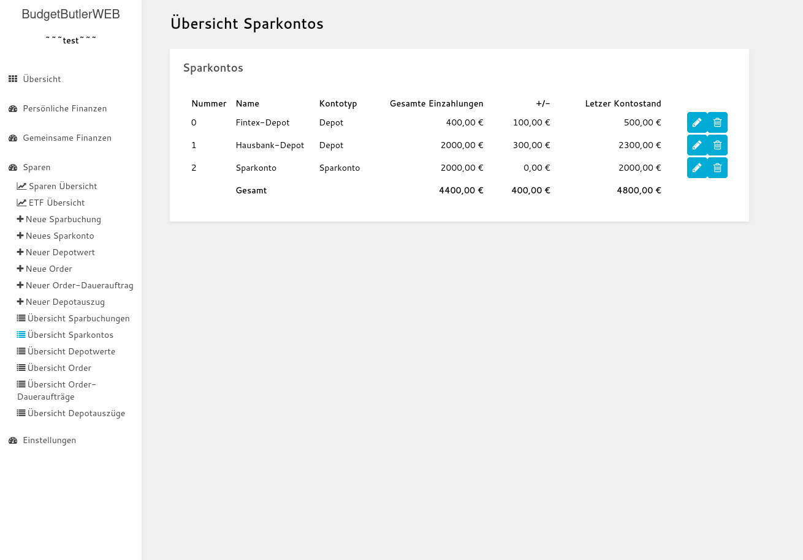
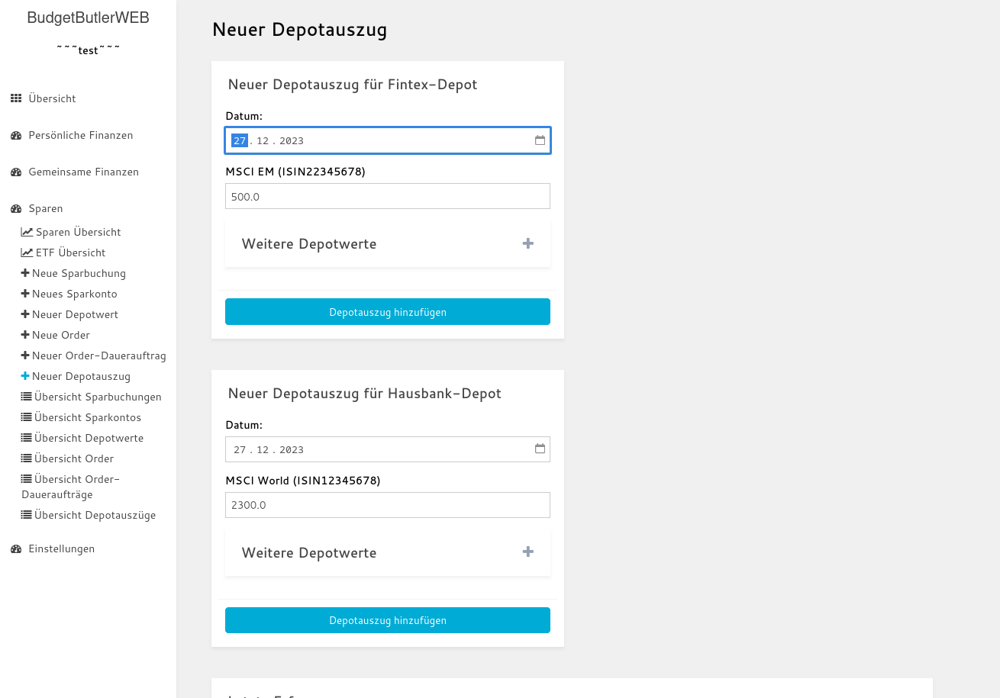

# BudgetButlerWeb

Ein einfaches haushaltsbuch für eine schlanke und individuelle Finanzverwaltung.

## Inhaltsverzeichnis

* [Idee](#idee)
* [Merkmale](#merkmale)
* [Mitmachen](#mitmachen)
* [Screenshots](#screenshots)
	* [Screenshots BudgetButlerWeb Offline Anwendung](#screenshots-budgetbutlerweb-offline-anwendung)
	* [Screenshots Begleiter Web-App](#screenshots-begleiter-web-app)
* [Offline Anwendung: BudgetButlerWeb](#offline-anwendung-budgetbutlerweb)
	* [Systemvoraussetzungen](#systemvoraussetzungen)
	* [Installation](#installation)
	* [BudgetButlerWeb starten](#budgetbutlerweb-starten)
	* [Umgebungsvariablen](#umgebungsvariablen)
	* [Migration von Version 3.0.0 auf 4.0.0 (von Python Client auf Rust Client)](#migration-von-version-300-auf-400-von-python-client-auf-rust-client)
* [Begleiter Web-App:](#begleiter-web-app)
	* [Build](#build)
	* [Betrieb](#betrieb)

## Idee

* Einfache lokale Datenhaltung: Die Daten sind im CSV-Format gespeichert und damit mit einem Textverarbeitungsprogramm
  oder einem Tabellenverarbeitungsprogramm zugänglich.
* Unkomplizierte Einnahmen/Ausgaben-Rechnung, keine doppelte Buchführung.
* Schlanke Begleiter-Web-App für unterwegs (online-Version, mobil-optimiert). Automatisierter Import der Daten in die
  lokale Anwendung
* Schlankes und minimalistisches Design
* Hohe Geschwindigkeit, auch bei großen Datenmengen
* Quelloffen
* Individualisierbar

## Merkmale

* Einzelbuchungen
	* Einzelbuchungen (erfassen, ändern, löschen)
	* Daueraufträge (erfassen, ändern (auch nachträglich), Betrag innerhalb der Ausführung anpassen, löschen)
	* Monatsübersicht
	* Jahresübersicht
	* Automatischer Import von Sparbuchungen, Order sowie gemeinsamen Buchungen in die "Einzelbuchungen"-Gesamtübersicht
	* Import von Einzelbuchungen aus der Begleiter Web-App

* Gemeinsame Buchungen
	* Erfassen, Ändern, Löschen
	* Abrechnung erstellen
	* Abrechnungenpython database_migrator/main.py ./Database_Test_User.csv exportieren und importieren
	* Import von gemeinsame Buchungen aus der Begleiter Web-App

* Sparen
	* Erfassen, Ändern und Löschen von Sparkontos, Sparbuchungen, Depots, Depotwerte (mit Typ: ETF, Fond, Einzelaktie,
	  Crypto oder Robo), Order, Order-Daueraufträgen sowie Depotauszüge
	* Sparen Übersicht:
		* Vergleich: Einnahmen, Ausgaben und Sparen über die Zeit
		* Zusammensetzung der Sparanlage
	* ETF-Portfolio Vergleichen: Kosten, Sektoren und Länder jeweils pro ETF und nach Anteil im Portfolio

* Konfiguration
	* Farbthema anpassen
	* Farben der Kategorien anpassen
	* Verwendung mehrerer Datenbanken
	* Backup der Datenbank-Datei anlegen
	* Kategorien übergreifend umbenennen
	* Kategorien für Eingabefelder ausschließen

## Mitmachen

* Fehler, Fragen, Anmerkungen oder Ideen gerne
  als ["ISSUE" hier hinterlassen](https://github.com/SebastianRzk/BudgetButlerWeb/issues)
* Code-Änderungen (Pull-Requests) immer bitte immer gegen den
  `dev`-[Branch hier hin](https://github.com/SebastianRzk/BudgetButlerWeb/pulls)
* [Hier liegt der blanke Code](https://github.com/SebastianRzk/BudgetButlerWeb)
* [Hier liegen die Docker-Images für die Begleiter Web-App](https://hub.docker.com/u/sebastianrzk),
  und [hier sind Deployment Beispiele für die Begleiter Web-App](https://github.com/SebastianRzk/BudgetButlerWeb/tree/master/butler_online_distribution)

## Screenshots

### Screenshots BudgetButlerWeb Offline Anwendung

#### Einzelbuchungen

#### Gemeinsame Buchungen

#### Sparen

### Screenshots Begleiter Web-App

## Offline Anwendung: BudgetButlerWeb

### Systemvoraussetzungen

* Rust / Cargo
* Versionierung: git
* Anwendungsicon sowie Startup-Skript: shell und npm (für Electron-Client)
* Falls nicht der Electron-Client verwendet wird: Webbrowser (z.B. Firefox oder Chromium)

### Installation

Das Git-Repository klonen:

	git clone https://github.com/SebastianRzk/BudgetButlerWeb.git

Ins Projektverzeichnis wechseln:

	cd BudgetButlerWeb

Anwendung bauen

    sh build.sh

Optional: Anwendungsicon anlegen:

    sh create_desktop_shortcut.sh

### BudgetButlerWeb starten

Die Applikation kann über das Anwendungsicon gestartet werden

Alternativ kann der Electron Client manuell gestartet werden, dieser startet das Rust-Backend automatisch und stoppt
dieses, wenn das Fenster geschlossen wird.

	cd ./target/ && ./application-wrapper/budgetbutlerweb

Alternativ kann der Server auch manuell gestartet werden:

    de ./target/ && ./budgetbutlerweb

Über ein Webbrowser kann die Webseite nun lokal erreicht werden:

    http://localhost:5000

### Softwaretests ausführen

Alle Softwaretests mit pytest starten:

	cargo test

### Updates

BudgetButlerWeb aktualisieren:

	# Code aktualisieren
	git pull

    # Anwendung neu bauen
    build.sh

## Umgebungsvariablen

| Wert                                 | Default    | Beschreibung                                            |
|--------------------------------------|------------|---------------------------------------------------------|
| BUDGETBUTLERWEB_DATABASE_PATH        | ..         | Ordner an dem die Datenbanken gesucht werden sollen.    |
| BUDGETBUTLERWEB_CONFIG_PATH          | ..         | Ordner an dem die Configuration gesucht werden soll.    |
| BUDGETBUTLERWEB_DATABASE_BACKUP_PATH | ../Backups | Ordner in welchem die Datenbank-Backups abgelegt werden |

### Migration von Version 3.0.0 auf 4.0.0 (von Python Client auf Rust Client)

1. Cargo installieren
2. Daten automatisch mit migrieren (bitte <dein Nutzername> durch deinen Nutzername ersetzen)

   python database_migrator/main.py ./Database_<dein Nutzername>.csv

## Begleiter Web-App:

### Build

#### Anforderungen zum Build

#### Build in der Entwicklungsumgebung

Systemanforderungen:

* npm
* rust und mysql library (z.B. MariaDB)

Vorgehen:

* Frontend:

	* In das Verzeichnis `butler_online/budgetbutler` wechseln
	* Mit `npm install` fehlende Abhängigkeiten installieren
	* Angular-Build anstoßen `npm run build -- --configuration=production`

* Backend:

	* In das Verzeichnis `butler_online_api` wechseln
	* Rust-Build anstoßen `cargo build --release`

oder:

Systemanforderungen:

* docker (und docker-compose)

Vorgehen:

* In das Verzeichnis `butler_online_distribution/budget_butler_local_build` wechseln
* Build-Skript ausführen: `sh build_and_run_it.sh`

### Betrieb

Systemanforderungen für den Betrieb:

* docker und docker-compose

Ein Beispiel-Docker-Compose-File kann in `butler_online_distribution/budget_butler` eingesehen werden.
Für den Betrieb müssen in `api.env` sowie in `db.env` Parameter beispielsweise für den OAuth-Flow ergänzt werden.
