# BudgetButlerWeb

Ein einfaches Haushaltsbuch für eine schlanke und individuelle Finanzverwaltung.

## Inhaltsverzeichnis

* [Idee](#idee)
* [Merkmale](#merkmale)
* [Unterstützte Plattformen](#unterstützte-plattformen)
* [Mitmachen](#mitmachen)
* [Screenshots](#screenshots)
	* [Screenshots BudgetButlerWeb Offline Anwendung](#screenshots-budgetbutlerweb-offline-anwendung)
	* [Screenshots Begleiter Web-App](#screenshots-begleiter-web-app)
* [ :link: Desktop Client](butler-offline.md)
* [ :link: Begleiter Web-App](butler-companion.md)
* [ :link: Changelog](changelog.md)

## Idee

* Einfache lokale Datenhaltung: Die Daten sind im CSV-Format gespeichert und sind damit mit einem Textverarbeitungsprogramm
  oder einem Tabellenverarbeitungsprogramm zugänglich.
* Unkomplizierte Einnahmen/Ausgaben-Rechnung, keine doppelte Buchführung.
* Schlanke Begleiter-Web-App für unterwegs (online-Version, mobil-optimiert). Automatisierter Import der Daten in die
  lokale Anwendung. Single-Sign-On über OpenID-Provider.
* Schlankes und minimalistisches Design
* Hohe Geschwindigkeit, auch bei großen Datenmengen
* Individualisierbar
* Quelloffen

## Merkmale

* **Einzelbuchungen**
	* **Erfassen, Ändern, Löschen**: Verwalte Einnahmen und Ausgaben einfach und effizient.
	* **Daueraufträge**: Richte wiederkehrende Zahlungen ein und passe diese flexibel an deine Bedürfnisse an. Egal ob
	  in der Zukunft oder in der Vergangenheit.
	* **Monats- und Jahresübersicht**: : Behalten deine Finanzen im Blick mit detaillierten Übersichten.
	* Automatischer Import von Sparbuchungen, Order sowie gemeinsamen Buchungen in die "Einzelbuchungen"-Gesamtübersicht
	* Importiere Buchungen aus der Begleiter Web-App.

* **Gemeinsame Buchungen**
	* **Verwalten**: Erfasse, ändere und lösche gemeinsame Buchungen.
    * **Abrechnungen**: Erstelle und exportiere Abrechnungen für gemeinsame Ausgaben. Viele verschiedene
      Abrechnungsmöglichkeiten stehen zur Verfügung.
    * **Import**: Importiere gemeinsame Buchungen aus der Begleiter Web-App.

* **Sparen**
	* **Verwalten**: Erfasse und verfolge dein Sparen von klassischen Sparkonten bis zu Aktien und ETFs, mittels
	  einfacher Input-Output-Rechnung. Berücksichtige dabei Kosten wie Depotgebühren oder Vorabpauschale.
	* **Übersichten**: Vergleichen deine Einnahmen, Ausgaben und Spar-Buchungen über die Zeit. Tracke die Performance
	  deiner einzelnen Werte sowie die Zusammensetzung deiner Sparanlage.
	* **ETF-Portfolio**: (aktuell nur durch manuelle Konfiguration möglich) Analysiere dein ETF-Portfolio nach Kosten,
	  Sektoren und Ländern.

* **Konfiguration**
	* **Anpassung**: Passe das Farbthema und die Kategorien nach deinen Wünschen an.
	* **Übergreifende Aktionen**: Führe Aktionen wie das Umbenennen von Kategorien oder das Ausschließen von
	  Kategorien für Eingabefelder durch.

## Unterstützte Plattformen

| Plattform               | Offline-Anwendung                                                                                                             | Nutzung Mobile Begleiter-App      | Deployment Mobile Begleiter App                                  |
|-------------------------|-------------------------------------------------------------------------------------------------------------------------------|-----------------------------------|------------------------------------------------------------------|
| Linux-Desktop           | :white_check_mark: [Installationsanleitung](butler-offline.md)                                                                | :white_check_mark: Über Webrowser | möglich, aktuell keine Dokumentation                             |
| Docker / docker-compose | :white_check_mark: [Installationsanleitung](butler-offline.md)                                                                |                                   | :white_check_mark: [Installationsanleitung](butler-companion.md) |
| Windows                 | :black_square_button: nicht getestet, theoretisch möglich über eine Anpassung der `build.sh`, alternativ über WSL oder Docker | :white_check_mark: Über Webrowser | :o: Wahrscheinlich nicht ohne Anpassungen möglich                |
| MacOS                   | :black_square_button: nicht getestet, theoretisch möglich über eine Anpassung der `build.sh`, alternativ über Docker          | :white_check_mark: Über Webrowser | :o: Wahrscheinlich nicht ohne Anpassungen möglich                |

## Mitmachen

* Fehler, Fragen, Anmerkungen oder Ideen gerne
  als ["ISSUE" hier hinterlassen](https://github.com/SebastianRzk/BudgetButlerWeb/issues)
* Code-Änderungen (Pull-Requests) immer bitte immer gegen den
  `dev`-[Branch hier hin](https://github.com/SebastianRzk/BudgetButlerWeb/pulls)
* [Hier liegt der Code](https://github.com/SebastianRzk/BudgetButlerWeb)
* [Hier liegen die Docker-Images für die Begleiter Web-App, sowie auch für die Desktop-App](https://hub.docker.com/u/sebastianrzk),
  und [hier sind Deployment Beispiele für die Begleiter Web-App](https://github.com/SebastianRzk/BudgetButlerWeb/tree/master/docker-compose-examples)

## Screenshots

### Screenshots BudgetButlerWeb Offline Anwendung

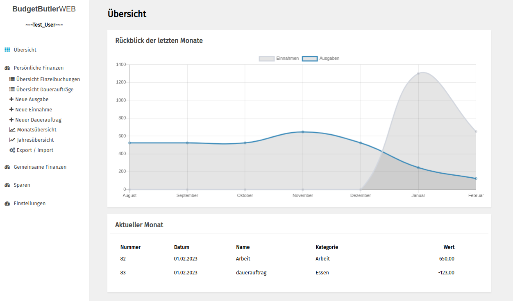

#### Einzelbuchungen

##### Übersicht Einzelbuchungen
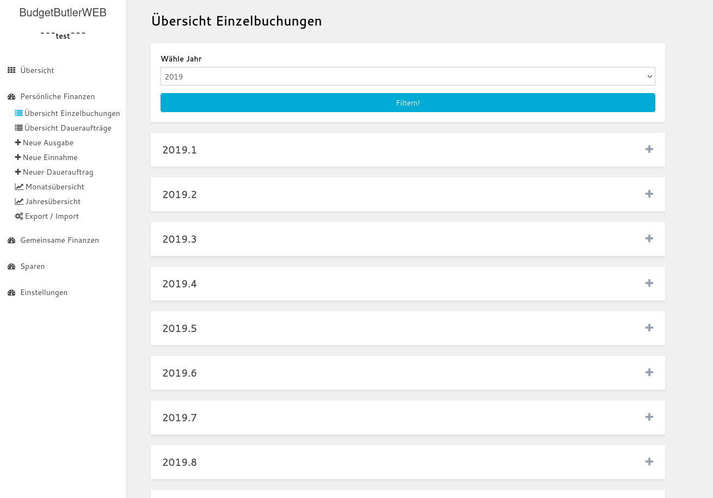

##### Daueraufträge hinzufügen
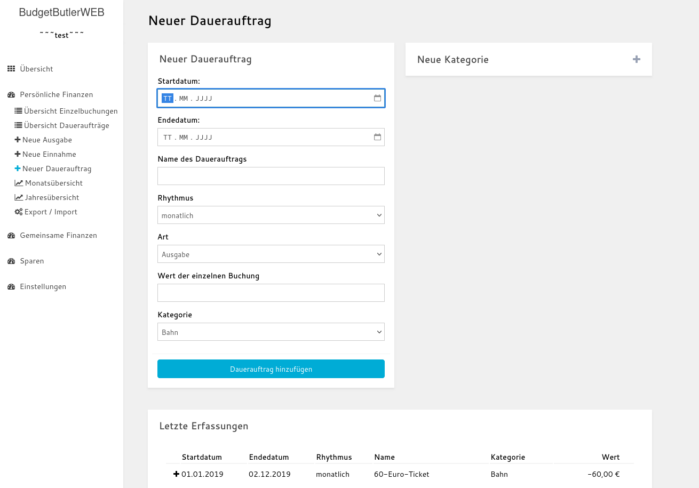

##### Übersicht Daueraufträge
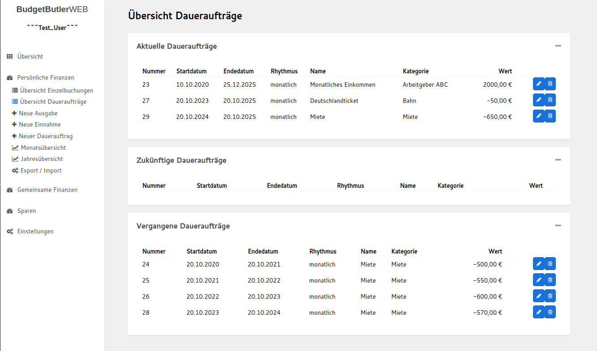

##### Jahresübersicht
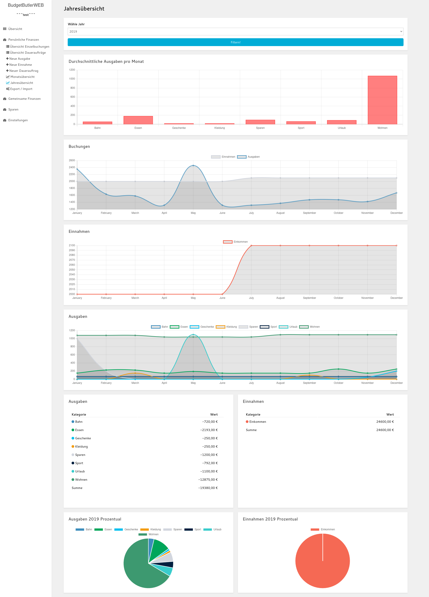

##### Monatsübersicht
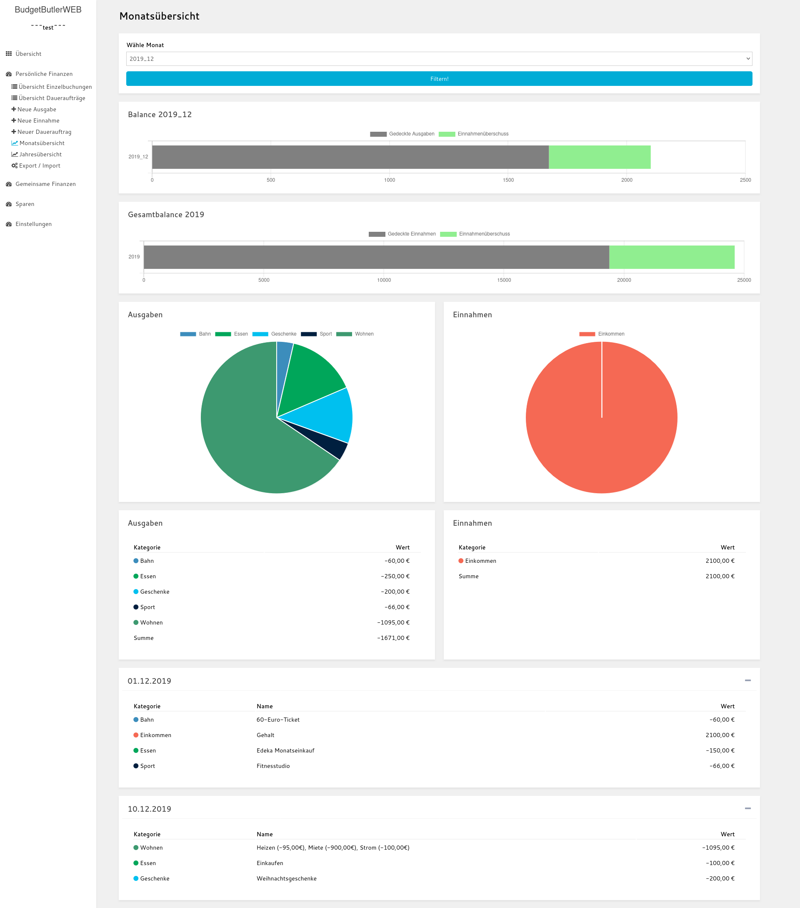

#### Gemeinsame Buchungen

##### Gemeinsame Buchungen hinzufügen
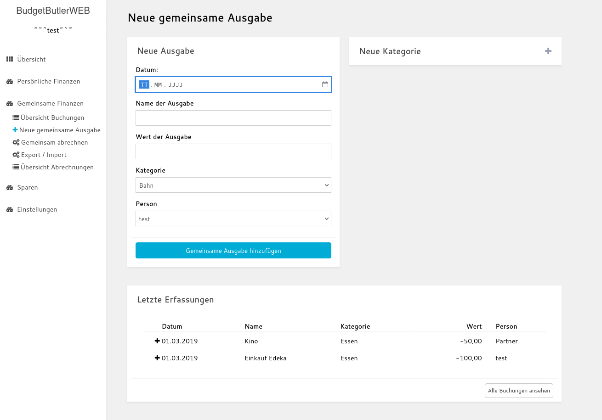

##### Gemeinsame Buchungen abrechnen
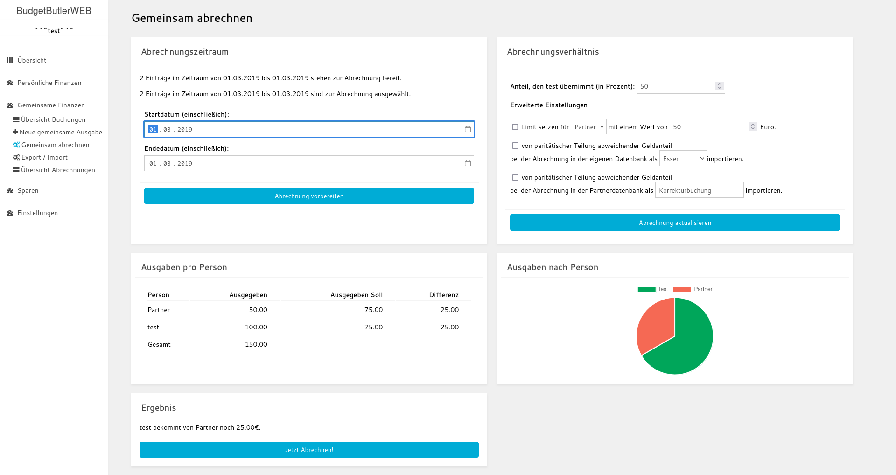

#### Sparen

##### Sparen Übersicht
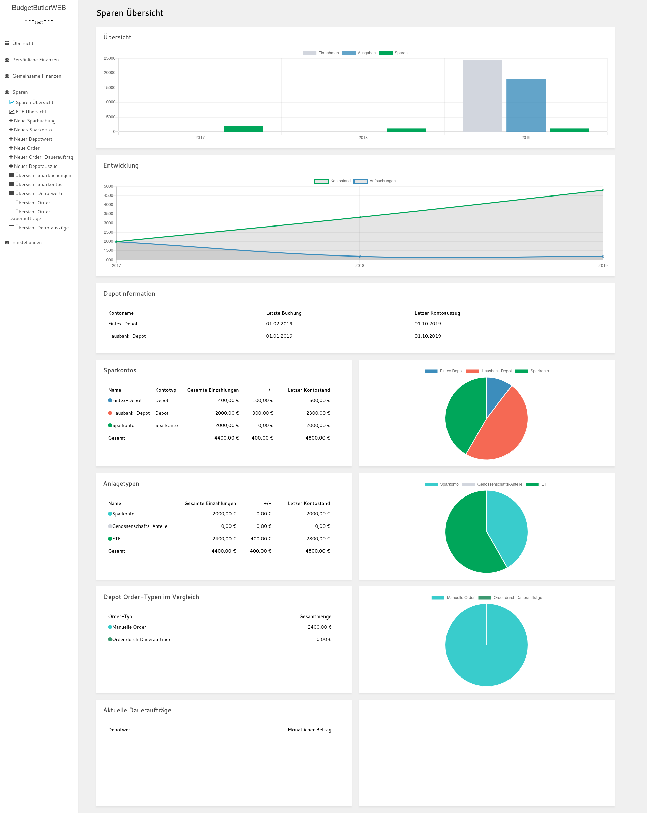

##### Depotwerte Übersicht
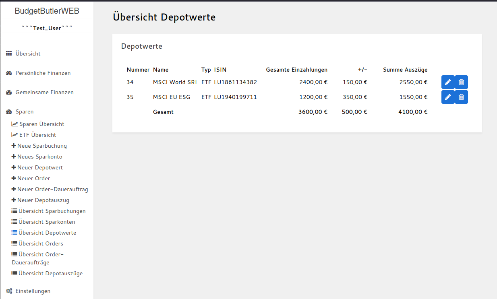

##### ETF Übersicht
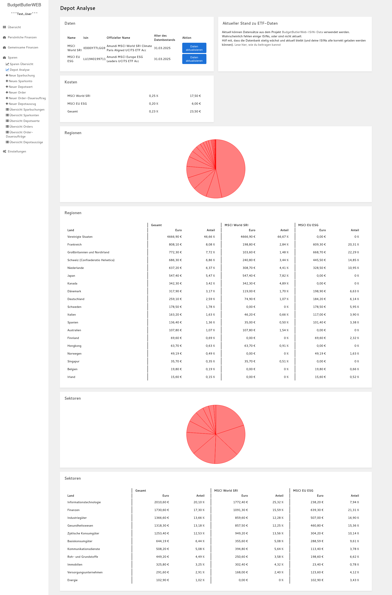

### Screenshots Begleiter Web-App

#### Menu
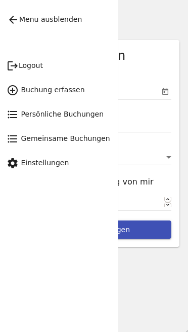

#### Schnellerfassung

#### Übersicht gemeinsame Buchungen
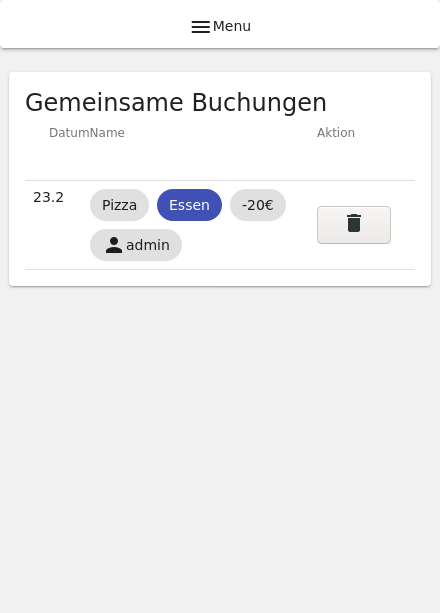

#### Übersicht gemeinsame Buchungen
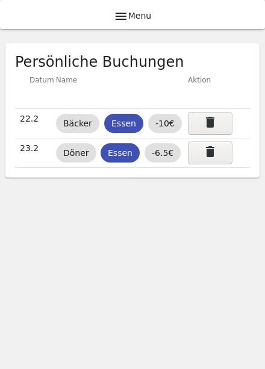

#### Dauerauftrag erfassen
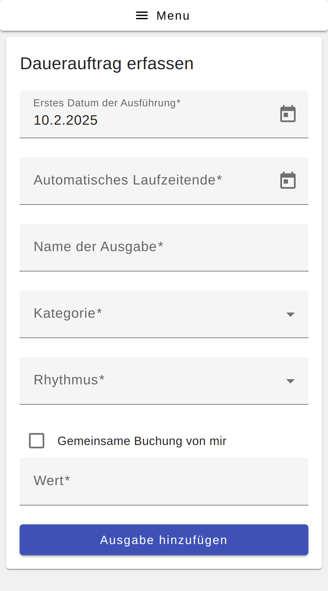

#### Übersicht Daueraufträge
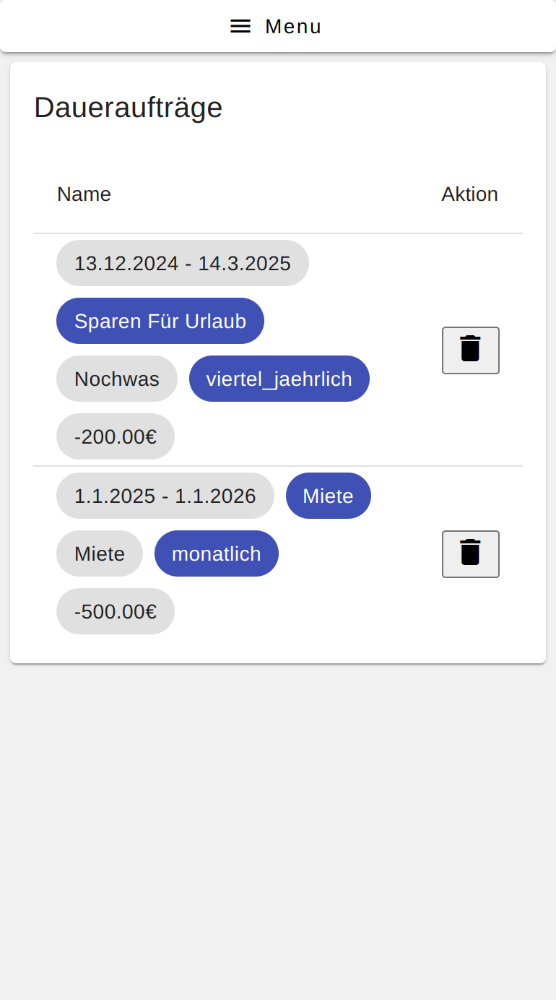

#### Buchungen erfassen in Desktop-Ansicht
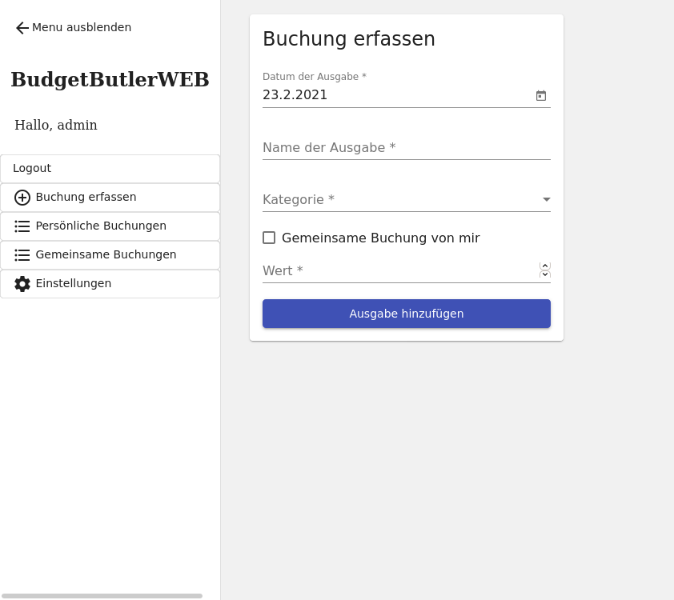