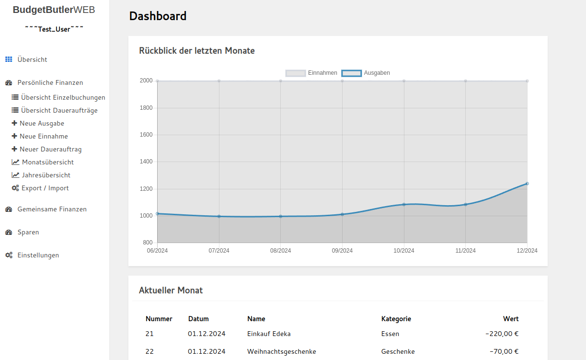
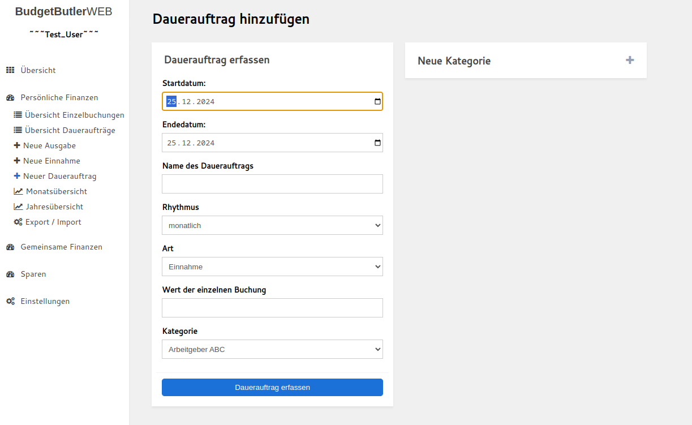
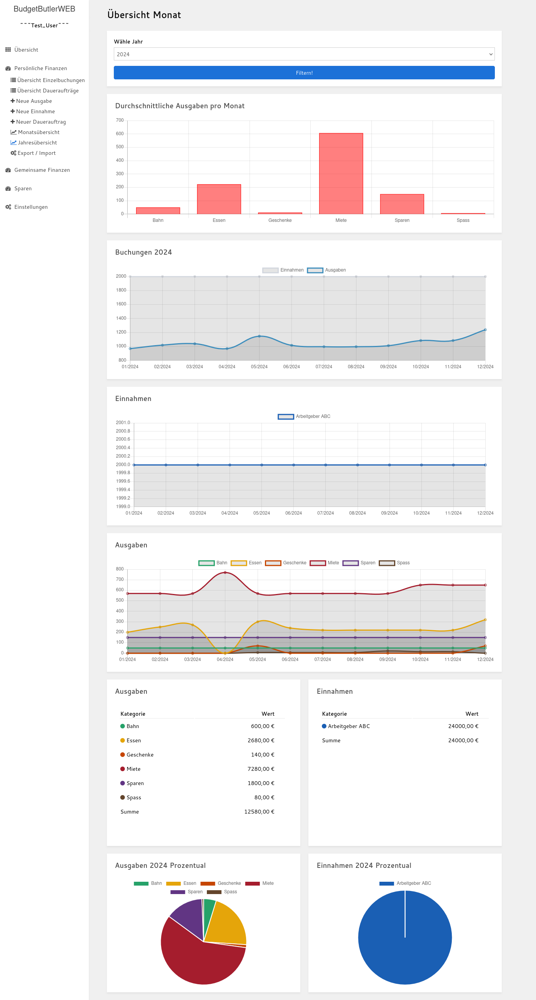
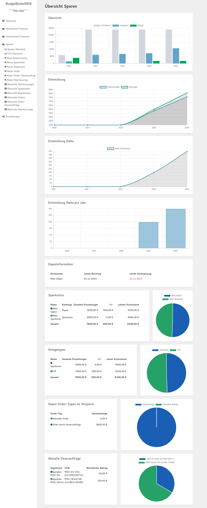

# BudgetButlerWeb

* TOC
  {:toc}

## Ankündigung

Der Offline-Client wird aktuell in `Rust` reimplementiert, und teilweise überarbeitet. Die neue Version wird in Kürze
veröffentlicht.

Grund dafür ist, dass die aktuelle Version in `Python` schwer wartbar ist und einige Bugs und Sicherheitslücken enthält.
Eine Überarbeitung
der aktuellen Version ist voraussichtlich aufwändiger als eine Neuentwicklung.

Auf dem Branch `dev_rust` kann der aktuelle Stand der Entwicklung eingesehen werden.

### Unterschiede zwischen Python Version (aktuell) und Rust Version (noch nicht final)

|                     | Python Version (aktuell)                                                                                                                                                                                                                                                                                                                                                   | Rust Version (noch nicht final)                                                                                                                                                                                                                                                                                                                                                                                                                             | 
|---------------------|----------------------------------------------------------------------------------------------------------------------------------------------------------------------------------------------------------------------------------------------------------------------------------------------------------------------------------------------------------------------------|-------------------------------------------------------------------------------------------------------------------------------------------------------------------------------------------------------------------------------------------------------------------------------------------------------------------------------------------------------------------------------------------------------------------------------------------------------------|
| Verhalten           | Bisherige Oberfläche                                                                                                                                                                                                                                                                                                                                                       | Oberfläche wird weitgehend übernommen                                                                                                                                                                                                                                                                                                                                                                                                                       | 
| --> Einzelbuchungen | Einzelbuchungen können theoretisch Tags enthalten, diese werden aktuell nicht angezeigt und sind auch nicht editierbar                                                                                                                                                                                                                                                     | Tags wurden entfernt                                                                                                                                                                                                                                                                                                                                                                                                                                        |
| --> Abrechnungen    | Bei anteiliger Abrechnung können die Buchung im "realen Verhältnis" importiert werden.  Metadaten von Abrechnungen gehen verloren.  Abrechnungen werden ausschließlich für den Partneraccount erstellt Abrechnugnen enthalten in eingen Fällen interne Berechnungsdaten, welche beim Import ignoriert werden.  Ungenaue Berechnung bei Teilung mit Restbetrag. | Abrechnungen werden immer 50/50 importiert (ggf. bei abweichendem realen Abrechnungsverhältnis mit Ausgleichsbuchungen).  Metadaten wie Abrechnungsdatum und Titel werden gespeichert und angezeigt.  Abrechungen werden für den eigenen Account sowie für den Partner-Account erstellt.  Abrechnungen enthalten nur noch die Daten, die sie benötigen. Bei Teilung mit Restbetrag wird am Ende der Abrechnung eine Korrekturbuchung eingefügt. |
| --> Datenbanken     | Es können mehrere Datenbanken in einer Applikation genutzt werden. Datenbanken können über einen Button gewechselt werden.  Beträge in der Datenbank sind dynamisch formatiert.                                                                                                                                                                                         | Pro laufender Applikation kann nur eine Datenbank geladen werden. Dafür kann die Anwendung mehrfach gestartet werden (todo).  Beträge in der Datenbank sind immer auf 2 Nachkommastellen formatiert.                                                                                                                                                                                                                                                     |
| --> Generell        | Buchungen in der Zukunft können zum Absturz führen (in bestimmten Fällen) Berechnungen mit Datentyp "float" kann zu Rundungsfehlern und Anzeigefehlern führen Updates des System-Pythons können zu Konflikten mit dem eingerichteten `venv` führen.                                                                                                                  | Buchungen in der Zukunft möglich   Berechnungen werden mit Dezimal-Datentyp durchgeführt, welcher auf 2 Kommastellen genau berechnet.  Stabiles Binary, welches nicht durch Updates beschädigt werden kann.																															                                                                                                                                                                                                            
| Technik             | Python mit Flask, Jinja und Pandas                                                                                                                                                                                                                                                                                                                                         | Rust mit Actix und Askama                                                                                                                                                                                                                                                                                                                                                                                                                                   |
|                     | Templates werden dynamisch zur Laufzeit generiert                                                                                                                                                                                                                                                                                                                          | Templates werden in Compile-Time überprüft und ausgerollt                                                                                                                                                                                                                                                                                                                                                                                                   |
|                     | Datenhaltung und Abfragen der Daten über Pandas und numpy                                                                                                                                                                                                                                                                                                                  | Eigene, typensichere Datenhaltung und typensichere Abfragen                                                                                                                                                                                                                                                                                                                                                                                                 |

## Idee

* Einfache lokale Datenhaltung: Die Daten sind im CSV-Format gespeichert und damit mit einem Textverarbeitungsprogramm
  oder einem Tabellenverarbeitungsprogramm zugänglich.
* Unkomplizierte Einnahmen/Ausgaben-Rechnung, keine doppelte Buchführung.
* Schlanke Begleiter-Web-App für unterwegs (online-Version, mobil-optimiert). Automatisierter Import der Daten in die
  lokale Anwendung
* Schlankes und minimalistisches Design
* Hohe Geschwindigkeit, auch bei großen Datenmengen
* Quelloffen
* Individualisierbar

## Merkmale

* Einzelbuchungen
    * Einzelbuchungen (erfassen, ändern, löschen)
    * Daueraufträge (erfassen, ändern (auch nachträglich), Betrag innerhalb der Ausführung anpassen, löschen)
    * Monatsübersicht
    * Jahresübersicht
    * Automatischer Import von Sparbuchungen, Order sowie gemeinsamen Buchungen in die "Einzelbuchungen"-Gesamtübersicht
    * Import von Einzelbuchungen aus der Begleiter Web-App

* Gemeinsame Buchungen
    * Erfassen, Ändern, Löschen
    * Abrechnung erstellen
    * Abrechnungen exportieren und importieren
    * Import von gemeinsame Buchungen aus der Begleiter Web-App

* Sparen
    * Erfassen, Ändern und Löschen von Sparkontos, Sparbuchungen, Depots, Depotwerte (mit Typ: ETF, Fond, Einzelaktie,
      Crypto oder Robo), Order, Order-Daueraufträgen sowie Depotauszüge
    * Sparen Übersicht:
        * Vergleich: Einnahmen, Ausgaben und Sparen über die Zeit
        * Zusammensetzung der Sparanlage
    * ETF-Portfolio Vergleichen: Kosten, Sektoren und Länder jeweils pro ETF und nach Anteil im Portfolio

* Konfiguration
    * Farbthema anpassen
    * Farben der Kategorien anpassen
    * Verwendung mehrerer Datenbanken
    * Backup der Datenbank-Datei anlegen
    * Kategorien übergreifend umbenennen
    * Kategorien für Eingabefelder ausschließen

## Weiterführende Links

* Fehler, Fragen, Anmerkungen oder Ideen gerne
  als ["ISSUE" hier hinterlassen](https://github.com/SebastianRzk/BudgetButlerWeb/issues)
* Code-Änderungen (Pull-Requests) immer bitte immer gegen den
  `dev`-[Branch hier hin](https://github.com/SebastianRzk/BudgetButlerWeb/pulls)
* [Hier liegt der blanke Code](https://github.com/SebastianRzk/BudgetButlerWeb)
* [Hier liegen die Docker-Images für die Begleiter Web-App](https://hub.docker.com/u/sebastianrzk),
  und [hier sind Deployment Beispiele für die Begleiter Web-App](https://github.com/SebastianRzk/BudgetButlerWeb/tree/master/butler_online_distribution)

## Screenshots

### Screenshots BudgetButlerWeb Offline Anwendung

#### Einzelbuchungen

#### Gemeinsame Buchungen

#### Sparen

### Screenshots Begleiter Web-App

## Offline Anwendung: BudgetButlerWeb

### Systemvoraussetzungen

* Python 3.10+
* Pip
* Versionierung: git
* Anwendungsicon sowie Startup-Skript: shell und npm (für Electron-Client)
* Falls nicht der Electron-Client verwendet wird: Webbrowser (z.B. Firefox oder Chromium)

### Installation

Das Git-Repository klonen:

	git clone https://github.com/SebastianRzk/BudgetButlerWeb.git

Ins Projektverzeichnis wechseln:

	cd BudgetButlerWeb

Optional: Anwendungsicon anlegen:

    sh create_shortcut.sh

### BudgetButlerWeb starten

Die Applikation kann über das Anwendungsicon gestartet werden. Der erste Start dauert durch die Installation der
benötigten Abhängigkeiten etwas länger. Dies ist nur beim ersten Start der Anwendung nach dem Klonen des Repositories
notwendig.

Alternativ kann das Start-Skript manuell aufgerufen werden. Dieses startet das Backend und das Frontend automatisch.
Beim ersten Start werden ggf. fehlende Abhängigkeiten nachinstalliert (für Python über `venv` und `pip`, `npm`
installiert den Electron-Client):

	sh start_butler_offline.sh

Alternativ kann der Server auch manuell gestartet werden:

    # venv anlegen
    python -m venv venv
    # venv aktivieren
    source venv/bin/activate
    # Abhängigkeiten installieren (falls nicht schon passiert)
    pip install -r butler_offline/requirements.txt
    # Flask starten
    flask --app butler_offline run

Über ein Webbrowser kann die Webseite nun lokal erreicht werden:

    http://localhost:5000

### Softwaretests ausführen

Alle Softwaretests mit pytest starten:

	pytest butler_offline

Testabdeckung mit pytest berechnen:

	pytest butler_offline --cov

### Updates

BudgetButlerWeb aktualisieren:

	git pull
    # Abhängigkeiten aktualisieren
    rm -rfv venv
    rm -rfv butler_offline_client/node_modules

## Umgebungsvariablen

| Wert                                 | Default    | Beschreibung                                            |
|--------------------------------------|------------|---------------------------------------------------------|
| BUDGETBUTLERWEB_DATABASE_PATH        | ..         | Ordner an dem die Datenbanken gesucht werden sollen.    |
| BUDGETBUTLERWEB_CONFIG_PATH          | ..         | Ordner an dem die Configuration gesucht werden soll.    |
| BUDGETBUTLERWEB_DATABASE_BACKUP_PATH | ../Backups | Ordner in welchem die Datenbank-Backups abgelegt werden |

## Begleiter Web-App:

### Build

#### Anforderungen zum Build

##### Build in der Entwicklungsumgebung

Systemanforderungen:

* npm
* rust und mysql library (z.B. MariaDB)

Vorgehen:

* Frontend:

    * In das Verzeichnis `butler_online/budgetbutler` wechseln
    * Mit `npm install` fehlende Abhängigkeiten installieren
    * Angular-Build anstoßen `npm run build -- --configuration=production`

* Backend:

    * In das Verzeichnis `butler_online_api` wechseln
    * Rust-Build anstoßen `cargo build --release`

oder:

Systemanforderungen:

* docker (und docker-compose)

Vorgehen:

* In das Verzeichnis `butler_online_distribution/budget_butler_local_build` wechseln
* Build-Skript ausführen: `sh build_and_run_it.sh`

### Betrieb:

Systemanforderungen für den Betrieb:

* docker und docker-compose

Ein Beispiel-Docker-Compose-File kann in `butler_online_distribution/budget_butler` eingesehen werden.
Für den Betrieb müssen in `api.env` sowie in `db.env` Parameter beispielsweise für den OAuth-Flow ergänzt werden.

## Ideen für die Zukunft / bekannte Limitierungen

### BudgetButlerWeb Offline

* Aktuell werden die Daten nur für eine retrospektive Visualisierung verwendet. Dabei könnte man die Daten auch für eine
  Projektion in die Zukunft verwenden. Dies konnte bei den Einnahmen/ Ausgaben sowie auch bei den Spar-Plänen nützlich
  sein.
* Implementierung von Tags an Einzelbuchung, um neben den der "Kategorie" noch weitere sortier- und durchsuchbare Marker
  zur Verfügung zu stellen. (Zum Beispiel Marker wie "steuerlich absetzbar" oder "Weihnachtsgeschenke" oder "
  Sommerurlaub")
* BudgetButlerWeb Anwendung im AUR verfügbar machen, damit Aktualisierungen automatisch über yay durchgeführt werden.
* Codequalität und Testabdeckung automatisiert und langfristig tracken (z.B. durch SonarCloud)

### BudgetButlerWeb Begleiter App

* Codequalität und Testabdeckung automatisiert und langfristig tracken (z.B. durch SonarCloud)

