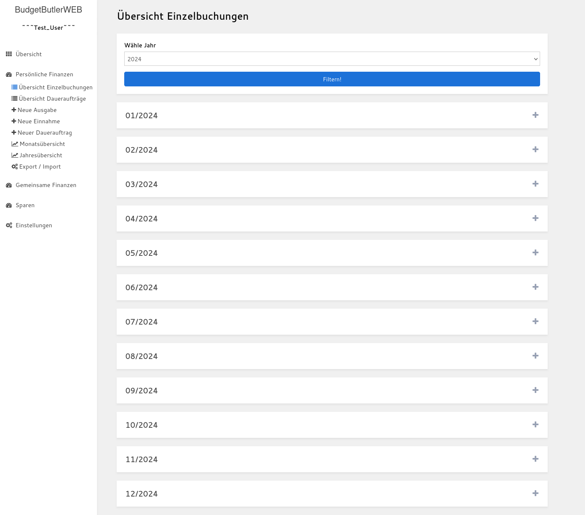
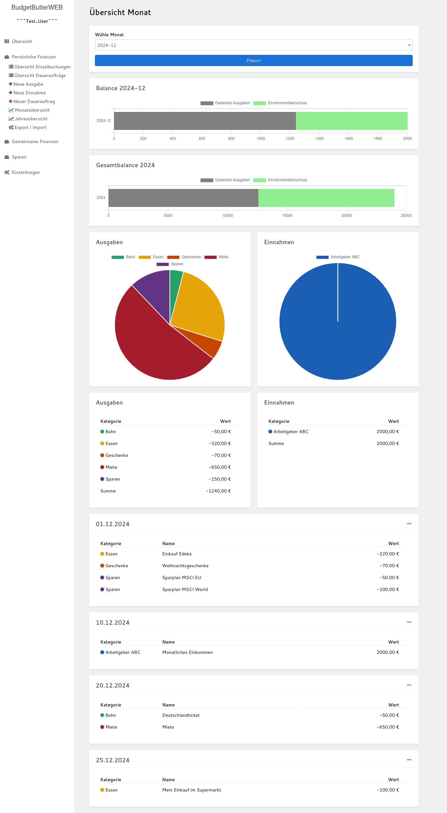
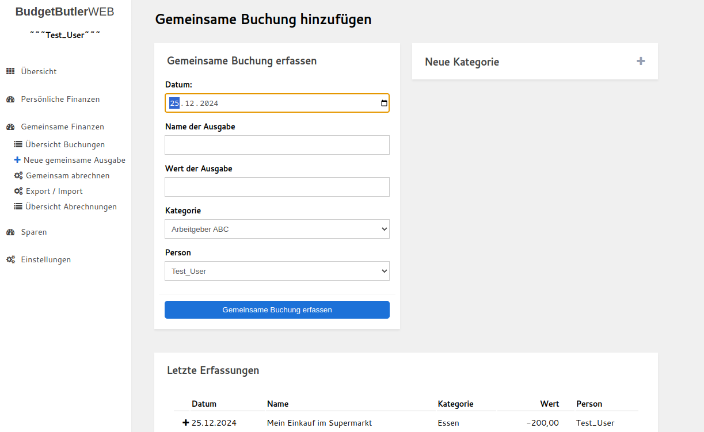
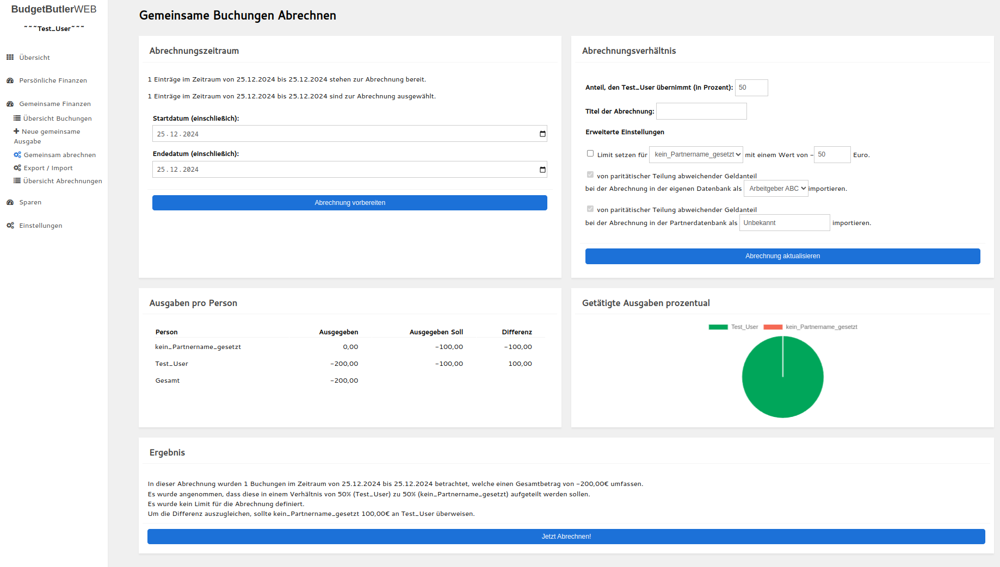

# BudgetButlerWeb

Ein einfaches haushaltsbuch für eine schlanke und individuelle Finanzverwaltung.

## Inhaltsverzeichnis

* [Idee](#idee)
* [Merkmale](#merkmale)
* [Mitmachen](#mitmachen)
* [Screenshots](#screenshots)
	* [Screenshots BudgetButlerWeb Offline Anwendung](#screenshots-budgetbutlerweb-offline-anwendung)
	* [Screenshots Begleiter Web-App](#screenshots-begleiter-web-app)
* [ :link: Desktop Client](butler-offline.md)
* [ :link: Begleiter Web-App](butler-companion.md)
* [ :link: Changelog](changelog.md)

## Idee

* Einfache lokale Datenhaltung: Die Daten sind im CSV-Format gespeichert und damit mit einem Textverarbeitungsprogramm
  oder einem Tabellenverarbeitungsprogramm zugänglich.
* Unkomplizierte Einnahmen/Ausgaben-Rechnung, keine doppelte Buchführung.
* Schlanke Begleiter-Web-App für unterwegs (online-Version, mobil-optimiert). Automatisierter Import der Daten in die
  lokale Anwendung
* Schlankes und minimalistisches Design
* Hohe Geschwindigkeit, auch bei großen Datenmengen
* Quelloffen
* Individualisierbar

## Merkmale

* Einzelbuchungen
	* Einzelbuchungen (erfassen, ändern, löschen)
	* Daueraufträge (erfassen, ändern (auch nachträglich), Betrag innerhalb der Ausführung anpassen, löschen)
	* Monatsübersicht
	* Jahresübersicht
	* Automatischer Import von Sparbuchungen, Order sowie gemeinsamen Buchungen in die "Einzelbuchungen"-Gesamtübersicht
	* Import von Einzelbuchungen aus der Begleiter Web-App

* Gemeinsame Buchungen
	* Erfassen, Ändern, Löschen
	* Abrechnung erstellen
	* Abrechnungenpython database_migrator/main.py ./Database_Test_User.csv exportieren und importieren
	* Import von gemeinsame Buchungen aus der Begleiter Web-App

* Sparen
	* Erfassen, Ändern und Löschen von Sparkontos, Sparbuchungen, Depots, Depotwerte (mit Typ: ETF, Fond, Einzelaktie,
	  Crypto oder Robo), Order, Order-Daueraufträgen sowie Depotauszüge
	* Sparen Übersicht:
		* Vergleich: Einnahmen, Ausgaben und Sparen über die Zeit
		* Zusammensetzung der Sparanlage
	* ETF-Portfolio Vergleichen: Kosten, Sektoren und Länder jeweils pro ETF und nach Anteil im Portfolio

* Konfiguration
	* Farbthema anpassen
	* Farben der Kategorien anpassen
	* Verwendung mehrerer Datenbanken
	* Backup der Datenbank-Datei anlegen
	* Kategorien übergreifend umbenennen
	* Kategorien für Eingabefelder ausschließen

## Mitmachen

* Fehler, Fragen, Anmerkungen oder Ideen gerne
  als ["ISSUE" hier hinterlassen](https://github.com/SebastianRzk/BudgetButlerWeb/issues)
* Code-Änderungen (Pull-Requests) immer bitte immer gegen den
  `dev`-[Branch hier hin](https://github.com/SebastianRzk/BudgetButlerWeb/pulls)
* [Hier liegt der blanke Code](https://github.com/SebastianRzk/BudgetButlerWeb)
* [Hier liegen die Docker-Images für die Begleiter Web-App](https://hub.docker.com/u/sebastianrzk),
  und [hier sind Deployment Beispiele für die Begleiter Web-App](https://github.com/SebastianRzk/BudgetButlerWeb/tree/master/docker-compose-examples)

## Screenshots

### Screenshots BudgetButlerWeb Offline Anwendung

#### Einzelbuchungen

#### Gemeinsame Buchungen

#### Sparen

### Screenshots Begleiter Web-App

