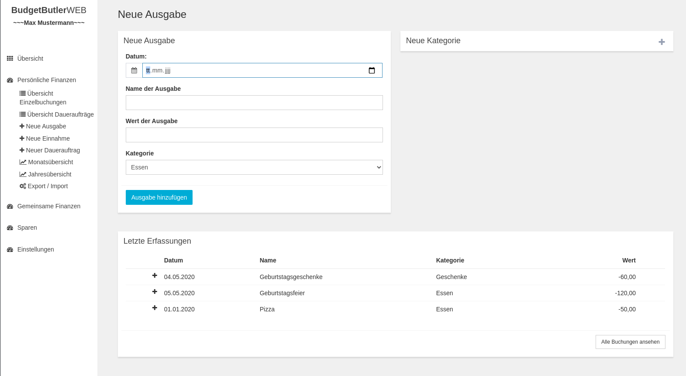
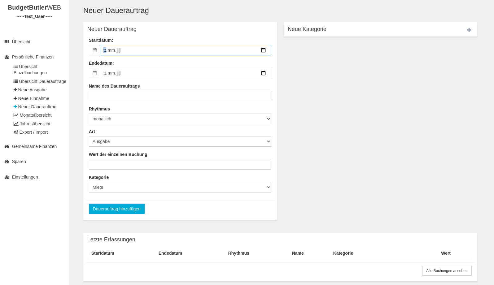
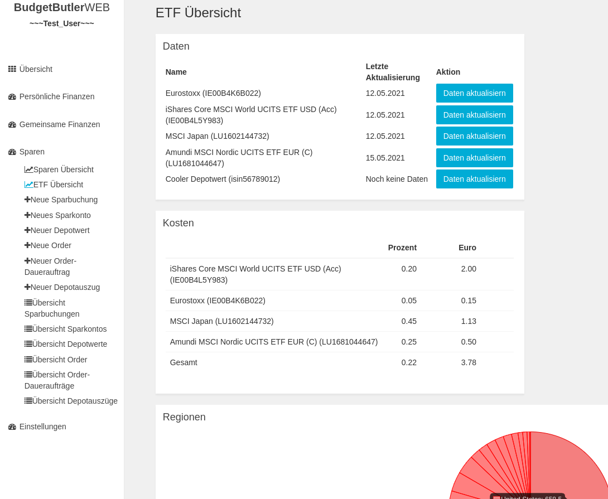
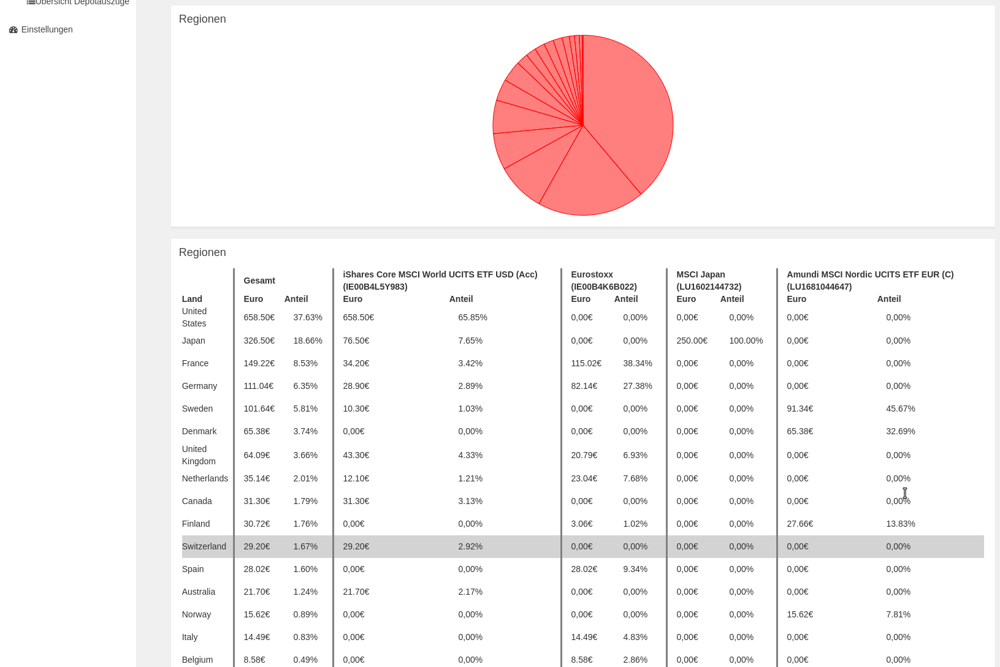
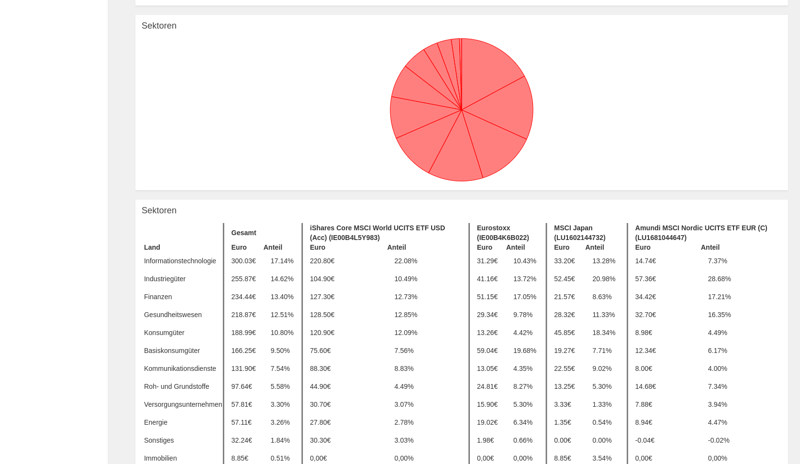

# Screenshots Desktop

* TOC {:toc}

[zurück zur Webseite + Dokumentation](https://SebastianRzk.github.io/BudgetButlerWeb/)

## Startseite

## Ausgaben erfassen

## Dauerauftrag erfassen

## Monatsübersicht

## Jahresübersicht

## Sparen Übersicht

## Kontos

## ETF-Portfolio Vergleich

