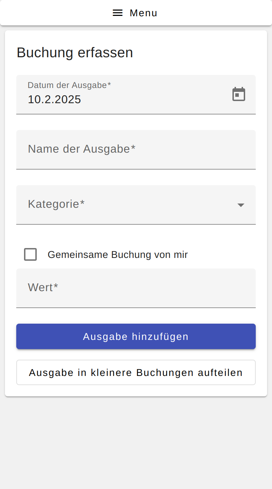
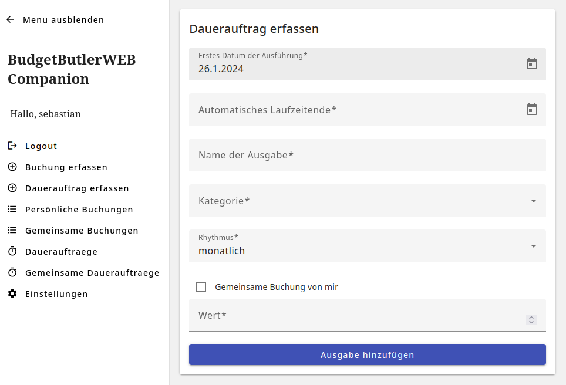
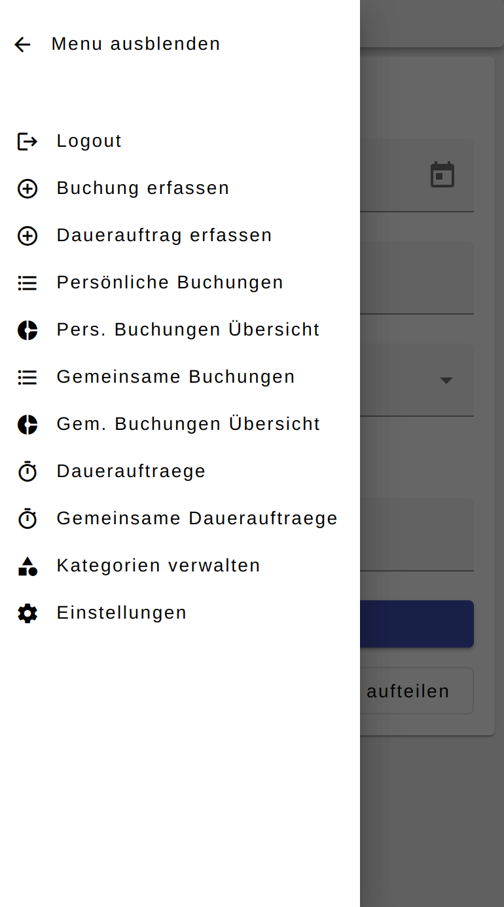

# Screenshots Companion App

* TOC {:toc}

[zurück zur Webseite + Dokumentation](https://SebastianRzk.github.io/BudgetButlerWeb/)

## Login

## Ausgaben erfassen

## Menu

## Einzelbuchungen

## Gemeinsame Buchungen

